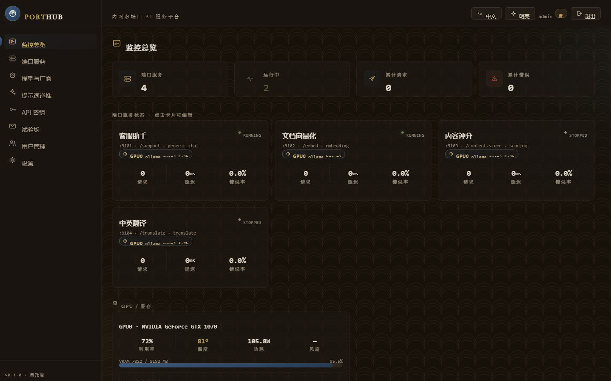
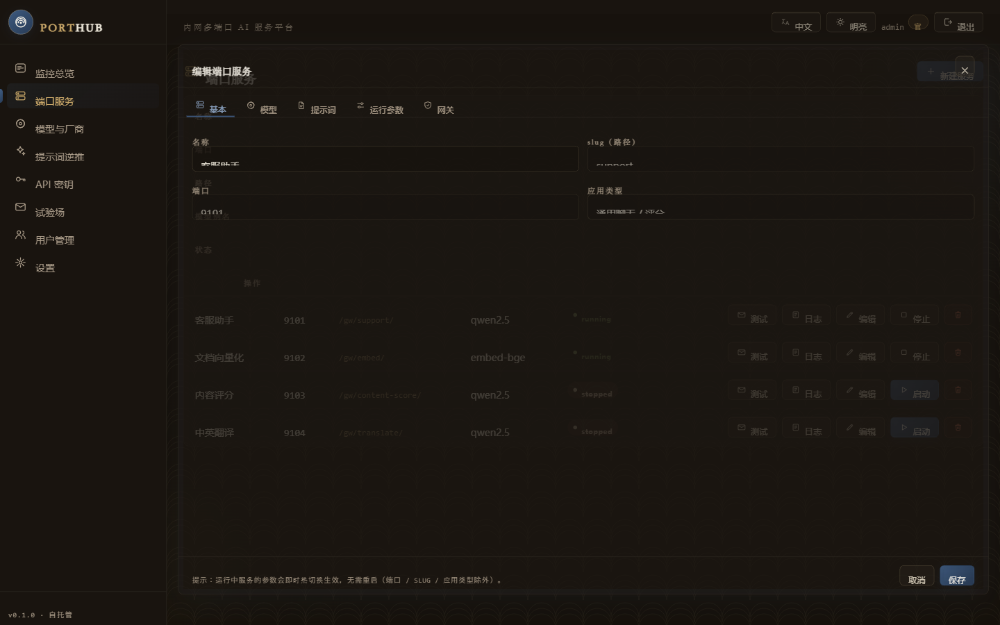
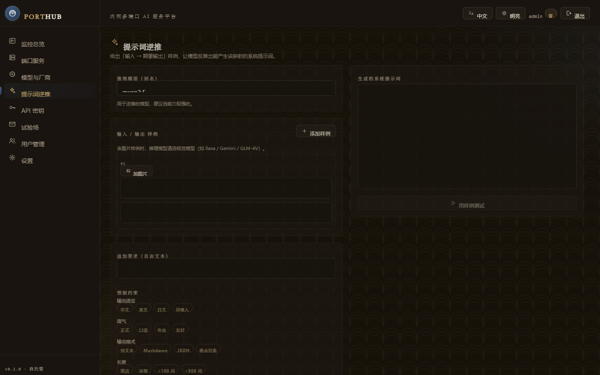
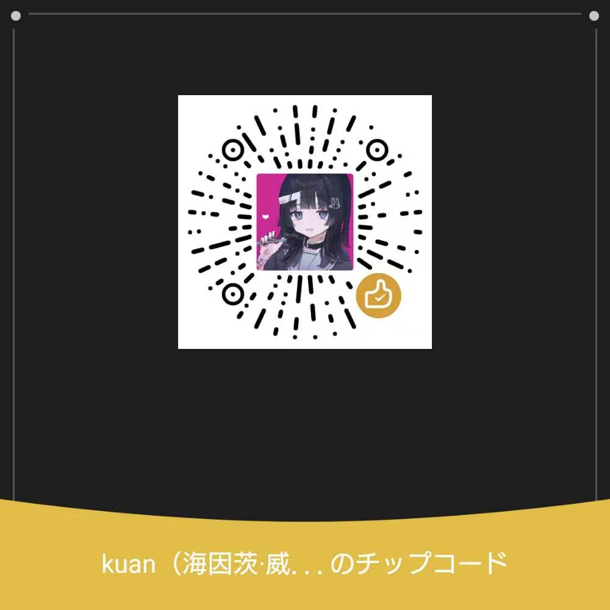

<div align="center">

# PORTHUB · AI Port Hub

[English](README.md) · [简体中文](README.zh-CN.md) · **日本語**

**セルフホスト型のマルチポート AI サービス管理プラットフォーム** — 1 台のマシンで複数のポートを開き、各ポートにアプリテンプレート（独自のシステムプロンプト + モデルルーティング）を割り当て、統一された OpenAI 互換ゲートウェイ経由で LAN に公開します。

[](https://github.com/mknjibhuvgyo2/portpilot-ai/actions/workflows/ci.yml)
[](LICENSE)


</div>

---

## 📸 スクリーンショット

| ダッシュボード | ポート編集 | プロンプト逆生成 |
| --- | --- | --- |
|  |  |  |

---

## ✨ 機能

**コア**
- **マルチポート編成** — ポートサービスを登録 → 起動/停止 → ヘルスチェック。各サービスは OpenAI 互換エンドポイントを公開。
- **統一モデル層** — モデルルート（別名）に 主モデル + フォールバック列 + 最終フォールバック文 + タイムアウト/リトライ + 同時実行上限。
- **モデルのホットスワップ** — 稼働中のポートのモデル/プロンプト/実行パラメータを**再起動なしで**変更。
- **リバースプロキシ ゲートウェイ** — `/gw/<slug>/...` を該当ポートへ転送、API キー認証は任意。

**アプリテンプレート（9 種）**
`generic_chat` · `scoring` · `translate` · `vision` · `summarize` · `embedding`（`/v1/embeddings`、RAG）· `rerank`（`/v1/rerank`、Jina/Cohere 互換）· `passthrough`（OpenAI ボディ完全透過：tools / JSON モード / seed …）· `custom`。

**プロバイダ**
- ネイティブ対応：**OpenAI 互換**、**Ollama**、**Anthropic（Claude）**、**Google Gemini**。
- ベンダープリセット 24 種・4 グループ（key + model を入力するだけ）：海外（OpenAI/Anthropic/Gemini/Groq/OpenRouter/Mistral/xAI）、**中国（DeepSeek/Qwen/Kimi/Zhipu GLM/Doubao/Hunyuan/MiniMax/StepFun/01.AI/Baichuan/iFlytek/SiliconFlow）**、ローカル（Ollama/LM Studio/llama.cpp/vLLM）、カスタム。
- カスタムリクエストヘッダ、マルチモーダル（画像/動画）入力。

**負荷分散**
- プール戦略：**加重ランダム / ラウンドロビン / 最少接続 / 最少 VRAM（GPU 使用率順）**。
- **障害サーキットブレーカー**、**GPU 指定**（pin GPU）、インスタンス間フォールバック。

**運用**
- **GPU/VRAM モニタリング**（NVML：使用率/温度/電力/ファン）、ダッシュボードに「サービス↔GPU」マップ。
- **使用量・コスト統計** — 実トークン、ポート/モデル/キー別、CSV エクスポート、キー別トレンド。
- **API キー管理** — 上限、使用量、コスト概算。
- **ローカルエンジン管理** — Ollama/LM Studio をワンクリック接続、Ollama モデルの一覧/取得（進捗ストリーム）/削除。
- **設定のバックアップ/移行** — 全 providers + routes + ports をエクスポート/インポート（キーは既定でマスク、インスタンス間移植可）。
- **リバースプロキシ設定の出力** — Nginx / Caddy 設定をワンクリック生成。
- **DB 自動マイグレーション** — 旧 DB は起動時に不足カラムを自動追加。

**PromptLab（プロンプト逆生成）**
- 「入力→出力」サンプル（画像対応）から**システムプロンプトを逆推論**。制約の選択、再現テスト、ライブラリ保存、ポートへのワンクリック適用。

**プラットフォーム**
- **RBAC ユーザー管理**（管理者/一般、ロックアウト防止）。
- **i18n 中 / 英 / 日**、ライト/ダークテーマ、和風（wafu）UI。
- 単一プロセス配備（バックエンドがビルド済みフロントを配信）、**Docker** ワンコマンド起動。

---

## 📦 ダウンロード

1. **ビルド済みインストーラ**（Python/Node 不要）— [Releases](https://github.com/mknjibhuvgyo2/portpilot-ai/releases) を参照：
   - Windows x64 — `porthub-<ver>-windows-x64.zip`（解凍して `porthub.exe` を実行）
   - Linux x64 / arm64 — `.tar.gz` または `.deb`（`sudo dpkg -i porthub_<ver>_amd64.deb` 後 `porthub`）
   - macOS x64 / arm64 — `PORTHUB-<ver>-macos-<arch>.zip`（解凍して `PORTHUB.app`）

   起動すると `http://localhost:8000` を自動で開きます。実行データは実行ファイル横の `data/` に保存。ポート 8000 が使用中なら、ランチャーが**次の空きポートを自動選択**します。

2. **Docker イメージ** — GHCR に公開：`ghcr.io/mknjibhuvgyo2/portpilot-ai`（下記参照）。
3. **ソースから** — 「ローカル開発」を参照。

> macOS は未署名 `.app` の初回起動を Gatekeeper がブロックします：右クリック → 開く、または `xattr -dr com.apple.quarantine PORTHUB.app`。

---

## 🚀 Docker クイックスタート

> Docker（Compose 含む）が必要です。

**Bash / macOS / Linux**
```bash
git clone https://github.com/mknjibhuvgyo2/portpilot-ai.git porthub
cd porthub
HUB_ADMIN_PASSWORD=change-me docker compose up -d --build
```

**Windows PowerShell**
```powershell
git clone https://github.com/mknjibhuvgyo2/portpilot-ai.git porthub
cd porthub
$env:HUB_ADMIN_PASSWORD = "change-me"; docker compose up -d --build
```

**http://localhost:8000** を開き、`admin` と設定したパスワードでログイン。

<details>
<summary>Compose を使わない場合（<code>docker run</code>）</summary>

**Bash**（行継続は `\`）：
```bash
docker build -t ai-port-hub .
docker run -d -p 8000:8000 -v porthub-data:/app/data \
  -e HUB_ADMIN_PASSWORD=change-me \
  --add-host host.docker.internal:host-gateway \
  ai-port-hub
```

**Windows PowerShell**（行継続はバッククォート `` ` ``。`\` では**ありません**）：
```powershell
docker build -t ai-port-hub .
docker run -d -p 8000:8000 -v porthub-data:/app/data `
  -e HUB_ADMIN_PASSWORD=change-me `
  --add-host host.docker.internal:host-gateway `
  ai-port-hub
```

または 1 行（どのシェルでも可）：
```text
docker run -d -p 8000:8000 -v porthub-data:/app/data -e HUB_ADMIN_PASSWORD=change-me --add-host host.docker.internal:host-gateway ai-port-hub
```
</details>

- 実行データ（SQLite / シークレットキー / プロンプトライブラリ）はボリューム `/app/data` に永続化。
- ホストのローカルエンジン（Ollama `:11434` / LM Studio `:1234` / llama.cpp `:8085`）へは `host.docker.internal` でアクセス。
- **GPU/VRAM モニタリング**：`docker run`（または compose の GPU 設定ブロック）に `--gpus all` を付けると、コンテナ内の NVML がホスト GPU を認識します（[NVIDIA Container Toolkit](https://docs.nvidia.com/datacenter/cloud-native/container-toolkit/latest/install-guide.html) が必要。Windows は Docker Desktop + WSL2 GPU）。付けない場合はダッシュボードに「GPU 未検出」と表示されます。**コンテナを再作成するたびにこのフラグを付け直してください。**
- UI で作成した**ポートサービス**はコンテナ内で各自のポートにバインドします：必要に応じて `-p` で公開、または Linux では `--network host`（compose に例あり）。
- `vX.Y.Z` タグを push すると GitHub Actions がイメージをビルドし GHCR に公開（`.github/workflows/release.yml`）。

---

## 🛠️ ローカル開発

**要件**：Python 3.12+、Node 20+（22 推奨）。

```bash
# バックエンド
cd backend
python -m venv .venv
# Windows: ./.venv/Scripts/python -m pip install -r requirements.txt
# *nix:    ./.venv/bin/python   -m pip install -r requirements.txt
uvicorn app.main:app --reload --port 8000

# フロントエンド（別ターミナル）
cd frontend
npm install
npm run dev        # http://localhost:5173 （/api と /gw を :8000 へプロキシ）
npm run build      # dist/ をバックエンドが :8000 で配信（本番）
```

ワンショット：`./scripts/start.sh`（macOS/Linux）または `./scripts/start.ps1`（Windows）、`dev` で開発モード。初回起動でコンソールに管理者パスワードを表示（または `backend/.env` に `HUB_ADMIN_PASSWORD`）。

**テスト / ビルド**
```bash
cd backend && pytest -q          # バックエンド単体テスト
cd frontend && npm run build     # 型チェック + ビルド
```

---

## 🔌 使い方

1. **モデル / プロバイダ** → プロバイダを追加（プリセット or ローカル Ollama）。
2. **モデルルート**を追加：主モデル + フォールバック列 + 負荷分散戦略 + 最終文。
3. **ポートサービス** → 新規：名称、slug、ポート、アプリ種別、モデルルート、システムプロンプト → 起動。
4. LAN クライアントから呼び出し：
   - ゲートウェイ経由（推奨・認証 + 使用統計）：`POST http://<host>:8000/gw/<slug>/v1/chat/completions`
   - 直結：`POST http://<host>:<port>/v1/chat/completions`

```bash
curl http://<host>:8000/gw/<slug>/v1/chat/completions \
  -H "Authorization: Bearer <api-key>" -H "Content-Type: application/json" \
  -d '{"model":"<route>","messages":[{"role":"user","content":"こんにちは"}]}'
```

---

## 🏗️ アーキテクチャ

```
backend/   FastAPI + SQLAlchemy(SQLite) + httpx — API / モデルルーティング / ポート編成 / ゲートウェイ
frontend/  Vue 3 + Vite + TS + Tailwind + Pinia — 管理 UI（中/英/日）
data/      実行時：sqlite / シークレット / プロンプトライブラリ / ログ（git 無視）
```

バックエンドは単一プロセスでフロントを配信 — 本番は `uvicorn` 1 コマンド、または Docker コンテナ 1 つ。

---

## 🔐 セキュリティ

- **既定の管理者パスワードを必ず変更**：`HUB_ADMIN_PASSWORD` で設定。未設定なら初回にランダム生成しコンソールへ 1 度表示。
- **JWT シークレット**：`HUB_SECRET_KEY`。空なら生成して `data/secret.key` に保存 — 再起動/複数インスタンスでセッションを維持するには明示設定を。
- `backend/.env` や `data/`（`secret.key`、`hub.db` を含む）は**コミットしない** — `.gitignore` 済み。
- **ゲートウェイ vs 直結**：直結ポートはゲートウェイを迂回し、**API キー検証なし・使用量に未計上**。認証/計測には `/gw/<slug>/` を使用。
- **LAN 向け**：公開する場合はリバースプロキシ（Nginx/Caddy・設定画面から出力可）+ TLS の背後に置き、「ゲートウェイに API キー必須」を有効化。
- 脆弱性は [SECURITY.md](SECURITY.md) に従って非公開で報告してください。

---

## 💛 スポンサー / Sponsor

**お金がありません。投げ銭してください 🙏**

WeChat 投げ銭コード：



---

## 🗺️ ロードマップ

- [ ] アプリテンプレート追加（音声/ASR、画像生成プロキシ）
- [ ] より細かい VRAM しきい値 / 混合重み スケジューリング
- [ ] 使用量トレンドグラフ、Prometheus メトリクス出力
- [ ] 既存スクリプト → アプリテンプレート移行ウィザード
- [ ] E2E テスト / Playwright

提案は Issues へ。実装済み機能は上記と [CHANGELOG.md](CHANGELOG.md) を参照。

## 🤝 コントリビュート

PR 歓迎！まず [CONTRIBUTING.md](CONTRIBUTING.md) と [CODE_OF_CONDUCT.md](CODE_OF_CONDUCT.md) をご一読ください。Bug / 機能は [Issue テンプレート](.github/ISSUE_TEMPLATE) を。

## 📄 License

[GPL-3.0](LICENSE) © PORTHUB contributors
